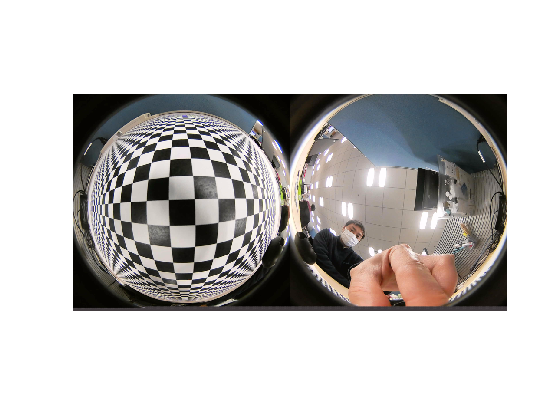
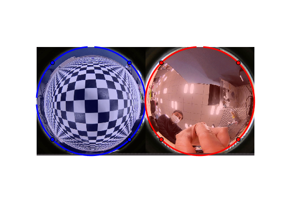
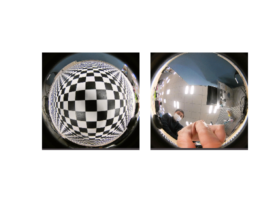
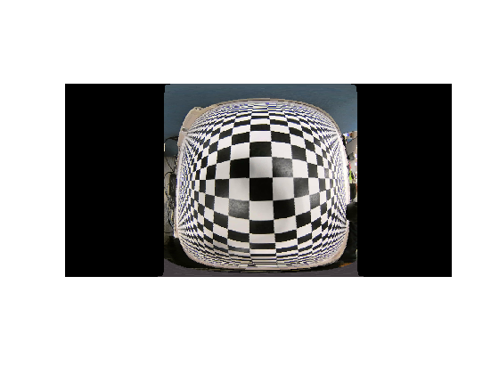
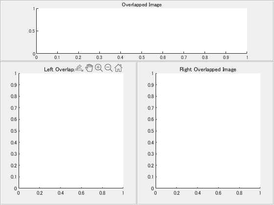
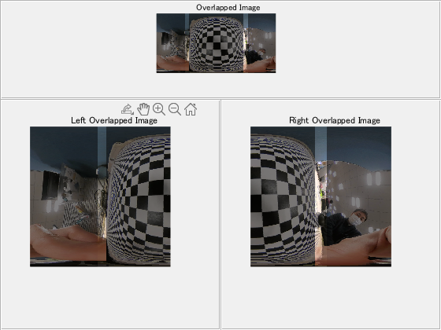
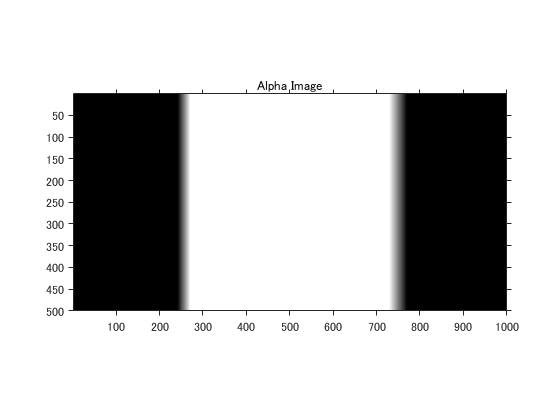
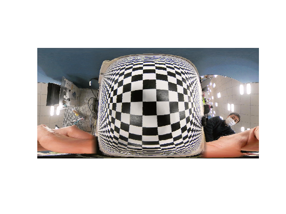

# Create a 360 degree image with two fisheye cameras 
This software is released under the MIT License, see LICENSE.txt.

This script shows how to create a 360 degree image (equirectangular image) from two fisheye images acquired by 360 camera device.


### Load Fisyeye Images


First of all, load the image aquired by 360 camera. Two fisheye mages acquired from a 360 camera are treated as one image that combines two fisheye lens images to the left and right.


```matlab
I = imread('sample.png');
I = imresize(I,[500 1000]);
imshow(I)
```



### Specify Each Fisheye Image 


Specify left and right fisheye images to divide into each image.


```matlab
h = int16(size(I,1));
w = int16(size(I,2));

imshow(I)
c1 = drawcircle('Center',[  w/4,h/2],'Radius',h/2,'Color','blue');
c2 = drawcircle('Center',[3*w/4,h/2],'Radius',h/2,'Color','red');
```



### Image Splitting


Split the input image into left and right fish eye images by specified ragions.


```matlab
% Split images
xy1 = c1.Center-c1.Radius;
xy2 = c2.Center-c2.Radius;

IL = imcrop(I,[c1.Center-c1.Radius, c1.Radius*2, c1.Radius*2]);
IR = imcrop(I,[c2.Center-c2.Radius, c2.Radius*2, c2.Radius*2]);

% Resize the size of right fisheye image to fit that of left fisheye image  
IR = imresize(IR,size(IL,[1 2]));

% Check images
figure
montage({IL,IR},'BackgroundColor','white','BorderSize',30)
```



### Convert Fisyeye Image to Equirectangular Image 


Project the left fisheye image to the equirectangular image using the custom function(imfish2equ). This function converts fa isheye coordinate to sphere coordinate, and then, converts sphere coordinate to equirectangular coordinate. Please change the following parameters and check the result of the equirectangular image.


   -  fov : Field of view [degree] 
   -  roll : Rotation chage of equirectangular image [degree] 
   -  tilt : Vertical change of equirectangular image [degree] 
   -  pan : Horizontal change of equirectangular image [degree] 

```matlab
% Set parameters
fov  = 180; % [degree]
roll = 1;   % [degree]
tilt = 0;   % [degree]
pan  = 2;   % [degree]

% Convert fisheye image to equirectangular image
EL = imfish2equ(IL,fov,roll,tilt,pan);

% Show the equirectangular image
imshow(EL)
```



### Manual Image Stitching


Each fisheye image is converted to each equirectangular image, and the two fisheye images are stitched to minimize the misalignment between images. In this example, we will stitch images by adjusting each parameter manually. 


After running this section, please repeat running the next section and find proper parameter setting.


```matlab
% Create figure
% * Don't close the figure window. This window is used in the next section.
figure
p1 = uipanel('Position',[0 0 0.5 0.7]);
p2 = uipanel('Position',[0.5,0,0.5 0.7]);
p3 = uipanel('Position',[0,0.7,1, 0.3]);
ax1 = axes(p1);
ax2 = axes(p2);
ax3 = axes(p3);
ax1.NextPlot="replacechildren";
ax2.NextPlot="replacechildren";
ax3.NextPlot="replacechildren";
title('Left Overlapped Image','Parent',ax1);
title('Right Overlapped Image','Parent',ax2);
title('Overlapped Image','Parent',ax3);
```




Adjust each parameter to minimaze misalignment of overlapped images while watching the figure opened in the previous section. Once you obtaine the parameters, you can apply the parameters to other images acquired with the same 360-degree camera.


```matlab
% For the left image
fovL  = 190; % [degree]
rollL = 1; % [degree]
tiltL = 0; % [degree]
panL  = 2; % [degree]
% For the right image
fovR  = 195; % [degree]
rollR = 3.5; % [degree]
tiltR = -2; % [degree]
panR  = 180; % [degree]

% Choose method of imshowpair function
method = 'blend';

% Convert fisheye images to equirectangular images
EL = imfish2equ(IL,fovL,rollL,tiltL,panL);
ER = imfish2equ(IR,fovR,rollR,tiltR,panR);
% Remove invalid image areas
[EL,maskL] = trimImageByFov(EL,fovL,panL);
[ER,maskR] = trimImageByFov(ER,fovR,panR);
% Show the overlapped image
Efused = imfuse(EL,ER,method);
wrange = round(size(Efused,2)*0.5);
imshow(Efused(:,1:wrange,:),'Parent',ax1);
imshow(Efused(:,wrange:end,:),'Parent',ax2);
imshow(Efused,'Parent',ax3);
```



### Image Blending


Combine the two adjusted images. With simple alpha blending, brightness changes at the borders will cause streaks in an blended image. So, we will chage alpha values linearly where they overlap [1].


```matlab
% Get index of overlapping area
maskB = maskL & maskR;

% Create an alpha image for blending
stat = regionprops('table',maskB,'Area','PixelIdxList','Image');
alpha = zeros(size(maskB));
idx = stat.PixelIdxList{1};
alpha(idx) = 1/size(stat.Image{1},2); 
idx = stat.PixelIdxList{2};
alpha(idx) = -1/size(stat.Image{2},2); 
alpha = cumsum(alpha,2);
figure

imshow(alpha);
axis on;
title('Alpha Image');
```



```matlab
% Bland images by useing the created alpha image
ELR = alpha.*double(EL) + (1-alpha).*double(ER);
ELR = uint8(ELR);

% Show the result
figure
imshow(ELR)
```



### View 360 degree image by camera view


Run the following custom function in your command window. You can move the camera viewpoint by drag and drop operation of your mouse.


* This custom function (imshow360) has non-support function for LiveScript as of R2019b. So, please try this funciton in command window or run as .m script. 


```matlab
% imshow360(ELR)
```
### Reference


[1] Tuan Ho, Madhukar Budagavi,  "2DUAL-FISHEYE LENS STITCHING FOR 360-DEGREE IMAGING" ([https://arxiv.org/ftp/arxiv/papers/1708/1708.08988.pdf](https://arxiv.org/ftp/arxiv/papers/1708/1708.08988.pdf))


  
### Support Function

```matlab
function [IE2,mask] = trimImageByFov(IE,fov,pan)
    w  = int16(size(IE,2));
    we = w*(fov/360)/2; % half widht
    ce = mod(w*(0.5+pan/360),w);

    idx = [ones(1,we),zeros(1,w-2*we),ones(1,we)];
    idx = circshift(idx,ce);

    IE2 = IE;
    IE2(:,~idx,:) = 0;
    mask = repmat(idx,[size(IE2,1), 1, size(IE2,3)]);
end
```


Copy right 2020 The MathWorks, Inc.


