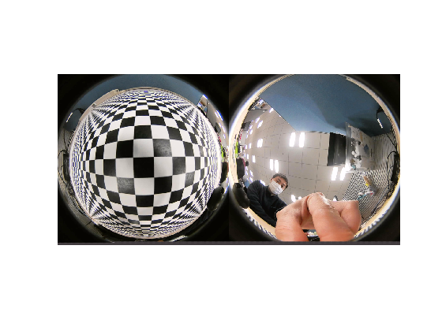
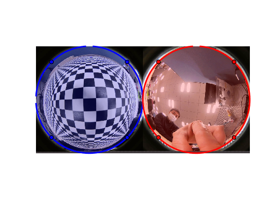
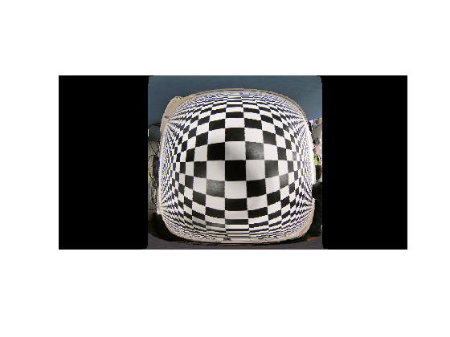
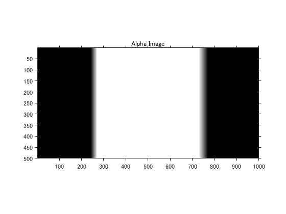

# 2つの魚眼レンズによる360度画像の作成
This software is released under the MIT License, see LICENSE.txt.

このスクリプトでは2つの魚眼レンズを搭載した360度カメラデバイスから取得した画像に対し、360度画像（正距円筒画像）の作成を行います。


### 360度カメラで取得した画像の読み込み


最初に画像を読み込みます。360カメラから取得した画像は、2つの魚眼レンズ画像を左右に結合した1つの画像として扱われます。


```matlab
I = imread('sample.png');
I = imresize(I,[500 1000]);
imshow(I)
```



### 2つの魚眼画像の範囲指定


各々の画像に分割するために範囲を指定します。


```matlab
h = int16(size(I,1));
w = int16(size(I,2));

imshow(I)
c1 = drawcircle('Center',[  w/4,h/2],'Radius',h/2,'Color','blue');
c2 = drawcircle('Center',[3*w/4,h/2],'Radius',h/2,'Color','red');
```



### 画像の分割


範囲指定した結果に基づき、画像の分割を行います。


```matlab
% 画像の分割
xy1 = c1.Center-c1.Radius;
xy2 = c2.Center-c2.Radius;

IL = imcrop(I,[c1.Center-c1.Radius, c1.Radius*2, c1.Radius*2]);
%IL(repmat(~msk1,[1 1 3])) = 0;
IR = imcrop(I,[c2.Center-c2.Radius, c2.Radius*2, c2.Radius*2]);
%IR(repmat(~msk1,[1 1 3])) = 0;

IR = imresize(IR,size(IL,[1 2]));

% 分割した画像の確認
figure
montage({IL,IR},'BackgroundColor','white','BorderSize',30)
```


### 正距円筒画像(Equirectangular Image)への変換と確認


左側の画像に対して正距円筒図への投影を自作関数を使って行います。この関数は魚眼画像の座標を球体座標に変換し、角パラメータの回転処理を行った後に、正距円筒座標に変換します。以下のパラメータを変更し、正距円筒画像の変化を確認してみます。


   -  fov：魚眼レンズの視野角度 
   -  roll：画像の回転 
   -  tilt：垂直方向の移動 
   -  pan：水平方向の移動 

```matlab
% パラメータの設定
fov  = 180; % [度]
roll = 1;   % [度]
tilt = 0;   % [度]
pan  = 2;   % [度]

% 自作関数による正距円筒図への投影
EL = imfish2equ(IL,fov,roll,tilt,pan);

% 可視化
imshow(EL)
```



### 2つの正距円筒画像の位置調整（スティッチング）


各々の画像を正距円筒画像に変換し、2つの画像のズレが少なくなるように重ね合わせ(スティッチング)を行います。スティッチングには各々の画像から特徴量抽出を行いマッチングをとる手法もあるようですが、今回は各パラメータをマニュアルで調整していきます。このセクションを実行後、次のセクションを繰り返し実行し、2つの画像がよく重なるように各パラメータを調整してください。


マニュアル操作を何度も行う場合は、[App Designer](https://jp.mathworks.com/help/matlab/app-designer.html)を使ってこれらの処理をアプリ化すると便利です。一度アプリを作成すれば、プログラミング知識がない方でもマウス操作で同じ処理を実行できます。


また、[MATLAB Compiler・](https://jp.mathworks.com/help/compiler/index.html)製品を活用することで、作成したアプリを実行形式ファイル化し、MATLABライセンスの無い他のPCへの配布と実行が可能になります。


```matlab
% 画像確認用のFigureを準備
% ※開いたWindowは閉じずに次のセクションを実行
figure
p1 = uipanel('Position',[0 0 0.5 0.7]);
p2 = uipanel('Position',[0.5,0,0.5 0.7]);
p3 = uipanel('Position',[0,0.7,1, 0.3]);
ax1 = axes(p1);
ax2 = axes(p2);
ax3 = axes(p3);
ax1.NextPlot="replacechildren";
ax2.NextPlot="replacechildren";
ax3.NextPlot="replacechildren";
title('Left Overlapped Image','Parent',ax1);
title('Right Overlapped Image','Parent',ax2);
title('Overlapped Image','Parent',ax3);
```


前のセクションで開いたFigureを見ながら各パラメータを変更し、二つの画像がよく重なるように調整してください。


一度求めたパラメータは同じ360度カメラで取得した他の画像にそのまま適用させることができます。


```matlab
% 画像（左）のパラメータ設定
fovL  = 190; % [度]
rollL = 1; % [度]
tiltL = 0; % [度]
panL  = 2; % [度]
% 画像（右）のパラメータ設定
fovR  = 195; % [度]
rollR = 3.5; % [度]
tiltR = -2; % [度]
panR  = 180; % [度]

% 可視化のメソッドを選択
method = 'blend';

% 正距円筒画像への変換
EL = imfish2equ(IL,fovL,rollL,tiltL,panL);
ER = imfish2equ(IR,fovR,rollR,tiltR,panR);
% 余分な領域の削除
[EL,maskL] = trimImageByFov(EL,fovL,panL);
[ER,maskR] = trimImageByFov(ER,fovR,panR);
% 左右の画像を重ねて表示
Efused = imfuse(EL,ER,method);
wrange = round(size(Efused,2)*0.5);
imshow(Efused(:,1:wrange,:),'Parent',ax1);
imshow(Efused(:,wrange:end,:),'Parent',ax2);
imshow(Efused,'Parent',ax3);
```


### 画像の合成（ブレンディング）


調整を終えた2つ画像に対し、重なり合った領域を合成していきます。単純なアルファブレンディングでは境界での急な輝度変化により筋が入ったような画像になってしまうため、アルファの値が重なり合った部分で線形に変化していくようにします[1]。


```matlab
% 重なり部分のインデックスを取得
maskB = maskL & maskR;

% 線形に変化するアルファ値の作成
stat = regionprops('table',maskB,'Area','PixelIdxList','Image');
alpha = zeros(size(maskB));
idx = stat.PixelIdxList{1};
alpha(idx) = 1/size(stat.Image{1},2); 
idx = stat.PixelIdxList{2};
alpha(idx) = -1/size(stat.Image{2},2); 
alpha = cumsum(alpha,2);
figure

imshow(alpha);
axis on;
title('Alpha Image');
```



```matlab
% 作成したアルファ値を用いて画像を合成
ELR = alpha.*double(EL) + (1-alpha).*double(ER);
ELR = uint8(ELR);

% 合成画像の確認
figure
imshow(ELR)
```


### カメラ視点での360度画像の確認


下記の自作関数をコマンドウィンドウで実行※してください。マウスのドラッグアンドドロップ操作でカメラ視点を動かすことができます。


※この自作関数にはR2019b時点でLiveScripに未対応の機能があるため、実行は”コマンドライン上”もしくは”.mファイル形式”でお試しください。


```matlab
% imshow360(ELR)
```
### Reference


[1] Tuan Ho, Madhukar Budagavi,  "2DUAL-FISHEYE LENS STITCHING FOR 360-DEGREE IMAGING" ([https://arxiv.org/ftp/arxiv/papers/1708/1708.08988.pdf](https://arxiv.org/ftp/arxiv/papers/1708/1708.08988.pdf))


  
### サポート関数

```matlab
function [IE2,mask] = trimImageByFov(IE,fov,pan)
    w  = int16(size(IE,2));
    we = w*(fov/360)/2; % half widht
    ce = mod(w*(0.5+pan/360),w);

    idx = [ones(1,we),zeros(1,w-2*we),ones(1,we)];
    idx = circshift(idx,ce);

    IE2 = IE;
    IE2(:,~idx,:) = 0;
    mask = repmat(idx,[size(IE2,1), 1, size(IE2,3)]);
end
```


Copy right 2020 Kazuya Machida


